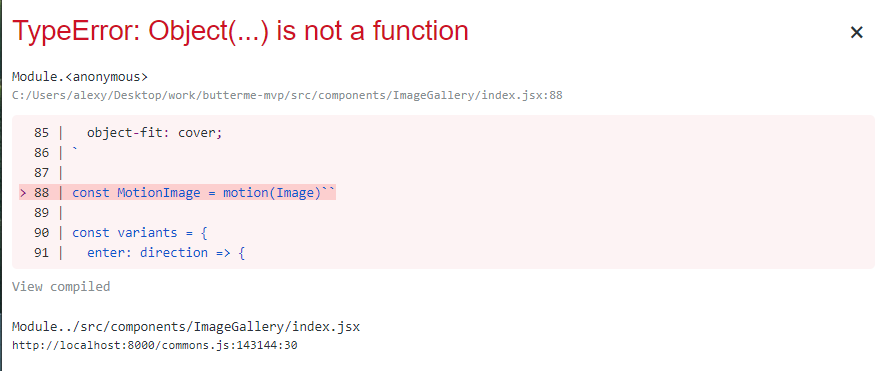
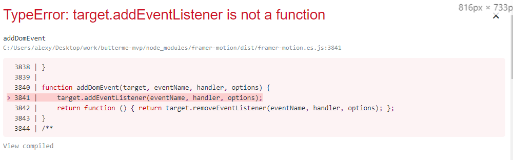
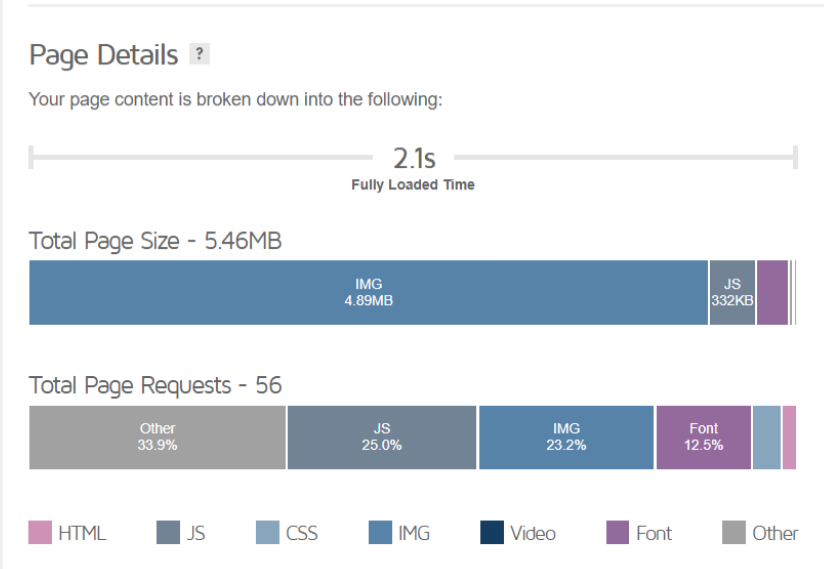
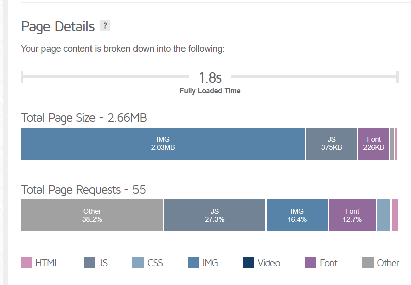

I've been working with Gatsby lately which is known to be really fast and it's variety of plugin ecosystem that you can just put in your app and use as data source is really amazing. However, things can get slower if you don't handle your visual content (images, gifs, videos) smartly and it ends up bursting your bundle size off the charts.

In this post, I'll be telling you what problems I faced while working with this which lead me to put the original image src as a hack (coz I was lazy to research) and it ended up slowing our site.

More info:

- [Gatsby Image Docs](https://www.gatsbyjs.com/plugins/gatsby-image/)
- [Gatsby Image Demo](https://using-gatsby-image.gatsbyjs.org/)

# 1. Adding it as a background image

Well, background images have been easy to do from CSS by adding just `background-image: url()` and it's as simple as that. However, in this way we couldn't use all the sick, speedy optimized images as gatsby images give.

So as a result I ended up putting the link to an unoptimized picture uploaded to imgur (to add to the charm, it even was over 1MB!!). This harmed the overall performance as well, coz the site needed to download all this data in the first load.


<!--  -->

## Shifting to `gatsby-background-image`

After going through [this issue](https://github.com/gatsbyjs/gatsby/issues/2470) I figured `[gatsby-background-image](https://www.gatsbyjs.com/plugins/gatsby-background-image/)` solved this problem really efficiently. Along with that, you can use their built in [art direction support](https://www.gatsbyjs.com/plugins/gatsby-background-image/#how-to-use-with-art-direction-support) which can show different image at different breakpoints.

Using this package was easy, this is how I implemented in my project.

```jsx
import React from "react";
import styled from "styled-components";
import BackgroundImage from "gatsby-background-image";
import { graphql, useStaticQuery } from "gatsby";

const StyledBackgroundImage = styled(BackgroundImage)`
  width: 100%;
  height: 60%;
  background-position: bottom center;
  background-repeat: repeat-y;
  background-size: cover;
`;

const Hero = () => {
  const data = useStaticQuery(
    graphql`
      query {
        file(relativePath: { eq: "cover/hero-home.jpg" }) {
          childImageSharp {
            fluid {
              ...GatsbyImageSharpFluid_withWebp
            }
          }
        }
      }
    `
  );

  const imageData = data.file.childImageSharp.fluid;

  return (
    <StyledBackgroundImage
      Tag="section"
      fluid={imageData}
      backgroundColor={`#040e18`}
    />
  );
};
```

- the `Tag` attribute renders the component as that HTML element.
- `fluid` takes in the image data you fetch from gql query
- `backgroundColor` adds a fallback background color
- also takes a `className` attribute to take in classes

# 2. Using it with Framer Motion

If you've ever thought of making an animation in react ecosystem, chances are you might have heard about [Framer Motion](http://framer.com/motion). I really like its intuitive API but can't really compare it to something else as it's the first animation library I used, but you'll fall in love with it even if you just go through their [docs (motion)](https://www.framer.com/api/motion/).

The thing I was building was a image carousel component (something similar to [this sandbox](https://codesandbox.io/s/framer-motion-image-gallery-pqvx3)) with drag facility. So I took a basic `img` tag and converted it into a motion component. For framer motion to work, you need to convert a component into motion component, like `motion.img, motion.div`.

In my case.

```jsx
import React from "react";
import { motion, AnimatePresence } from "framer-motion";
import styled from "styled-components";

const ImageWrapper = styled.div`
  background: var(--color-primary-01);
  height: 100%;
  position: relative;
`;

const Image = styled(motion.img)`
  display: block;
  width: 100%;
  height: 100%;
  object-fit: cover;
`;

const variants = {
  enter: direction => {
    return {
      x: direction > 0 ? 1000 : -1000,
      opacity: 0,
    };
  },
  center: {
    x: 0,
    opacity: 1,
  },
  exit: direction => {
    return {
      x: direction < 0 ? 1000 : -1000,
      opacity: 0,
    };
  },
};

const swipeConfidenceThreshold = 10000;
const swipePower = (offset, velocity) => {
  return Math.abs(offset) * velocity;
};

const ImageGallery = ({ productImages }) => {
  const [[current, direction], setProperties] = useState([0, 0]);

  const paginate = newDirection => {
    if (newDirection > 0) {
      if (current < productImages.length - 1) {
        setProperties([current + 1, newDirection]);
      }
    } else if (newDirection < 0) {
      if (current > 0) {
        setProperties([current - 1, newDirection]);
      }
    }
  };

  return (
    <ImageWrapper>
      <AnimatePresence initial={false} custom={direction} exitBeforeEnter>
        <Image
          key={current}
          src={productImages[current].originalSrc}
          alt={productImages[current].localFile.name}
          custom={direction}
          variants={variants}
          initial="enter"
          animate="center"
          exit="exit"
          transition={{
            x: { type: "spring", stiffness: 300, damping: 30 },
            opacity: { duration: 0.2 },
          }}
          drag="x"
          dragConstraints={{ left: 0, right: 0 }}
          dragElastic={1}
          onDragEnd={(e, { offset, velocity }) => {
            const swipe = swipePower(offset.x, velocity.x);

            if (swipe < -swipeConfidenceThreshold) {
              paginate(1);
            } else if (swipe > swipeConfidenceThreshold) {
              paginate(-1);
            }
          }}
        />
      </AnimatePresence>
    </ImageWrapper>
  );
};
```

See, how I'm using `originalSrc` on the `src` attribute of `<Image />` tag, which indeed is an html `` tag. This also became critical after sometime, as our carousel contained in minimum 4 images and there were like 4 pages where it was re-used. So now I had to move from plain `img` to using our optimized Gatsby Image.

### Failed attempt

My first attempt was of course changing `<Image />` to wrap a Gatsby Image instead of plain `img`, like shown and then creating another component to called `MotionImage` that wraps `Image` to make it a motion component.

```jsx
const Image = styled(Img)`
  display: block;
  width: 100%;
  height: 100%;
  object-fit: cover;
  pointer-events: none;
`;

const MotionImage = motion(Image)``;
```

This gave a TypeError straight off the bat.



However, I found a solution to convert a custom component to motion, which was through `motion.custom`.

```jsx
const MotionImage = motion.custom(Img);
```

And this popped up some more errors too 😥



### So ultimately,

I created a basic `motion.div` wrapper that contained just the `Img` component inside it, along with `pointer-events: none` so the image won't posses it's default drag behaviour.

```jsx
const Image = styled(Img)`
  display: block;
  width: 100%;
  height: 100%;
  object-fit: cover;
  pointer-events: none;
`

<AnimatePresence initial={false} custom={direction} exitBeforeEnter>
    <motion.div
      key={current}
      style={{ width: "100%", height: "100%" }}
      custom={direction}
      variants={variants}
      initial="enter"
      animate="center"
      exit="exit"
      transition={{
        x: { type: "spring", stiffness: 300, damping: 30 },
        opacity: { duration: 0.2 },
      }}
      drag="x"
      dragConstraints={{ left: 0, right: 0 }}
      dragElastic={1}
      onDragEnd={(e, { offset, velocity }) => {
        const swipe = swipePower(offset.x, velocity.x)

        if (swipe < -swipeConfidenceThreshold) {
          paginate(1)
        } else if (swipe > swipeConfidenceThreshold) {
          paginate(-1)
        }
      }}
    >
      <Image
        fluid={productImages[current].localFile.childImageSharp.fluid}
        alt={productImages[current].localFile.name}
      />
    </motion.div>
</AnimatePresence>
```

Note, I trimmed the code above to only contain the changed parts from the former mentioned code.

# Conclusion

These solved the issue of high bundle size of images and increased speed on first load as it optimized the images to lazy-load when viewed.

### **Before**



### After



**Happy NY in advanced! 🎄🥳**
