[MongoDB](https://www.mongodb.com/) is a cross-platform [document oriented database](https://www.mongodb.com/document-databases), which is one of the most popular NoSQL databases. It stores its data in JSON-like documents which are more natural to work with and easier to setup.

Now, to connect to a Mongo database from a Node.js server we can either use:

- Mongo, official driver [npm package](https://www.npmjs.com/package/mongodb)
- [Mongoose](https://mongoosejs.com/), elegant object modeling tool for mongo in nodejs

For this post, we're going to use **Mongoose**, which is widely known for having:

- Built in automatic validation of data
- Pre-define events to happen, before lets say a document gets saved
- Defining well structured schema for data

If you want to have a more deep reference to why **Mongoose** shines, you can visit this [closed stackoverflow thread](https://stackoverflow.com/questions/18531696/why-do-we-need-what-advantages-to-use-mongoose), and also the [official Mongoose docs](https://mongoosejs.com/).

# Spinning up a Node Express Server

Go ahead and create a new folder for this project.

Make sure to add the basic packages for making a server, we'll not go deep into any specifics other than how to get a Mongo DB instance connected to our server.

```bash
yarn add express mongoose
```

or

```bash
npm install express mongoose
```

We also need some dev dependencies to securely use private keys in our dev env i.e. `dotenv` and `nodemon` to restart our server on hitting save.

```bash
yarn add nodemon dotenv -D
```

or

```bash
npm install nodemon dotenv --save-dev
```

Now let's configure them together, in our root file which is, `index.js`. You can run, `nodemon index.js` in the command line to run our server (or make a npm script).

```jsx
const express = require("express");
const app = express();

app.get("/", (req, res) => res.send("Server is up and running"));

const PORT = process.env.PORT || 5000;
app.listen(PORT, () => console.log(`Server is running on port ${PORT}`));
```

_Just so we're always on the same page, I've put all the code we'll write here on this [Github Gist](https://gist.github.com/heytulsiprasad/c1a222a83fbae0e71258a0e9b3b91fa9). Feel free to follow along, if you're stuck._

# Add Environment Variables

While connecting to mongo we'll need to provide a connection string which can contain useful information you need to hide from open source platforms like GitHub, so let's put them in environment variables using the package called, `dotenv`.

So, create a file in the root directory named, `.env` and then copy and paste the following.

```
MONGO_PROD_URI=<prod key here>
MONGO_DEV_URI=<dev key here>
```

We'll put the actual strings here, after while exploring corresponding strategies. Finally, to be able to use these keys in our server, we need to add this line on top of our `index.js`.

```jsx
require("dotenv").config();
```

# Add Mongoose to Server

We've already installed the package, `mongoose` and now we can setup up this thing on `index.js`.

```jsx
const mongoose = require("mongoose");

mongoose
  .connect(process.env.MONGO_PROD_URI, {
    useNewUrlParser: true,
    useUnifiedTopology: true,
    useCreateIndex: true,
  })
  .then(() => console.log("Database connected!"))
  .catch(err => console.log(err));
```

This is how you connect to a mongodb instance from Node js, also make sure you pass all `useNewUrlParser`, `useUnifiedTopology` and `useCreateIndex` options as shown above otherwise you may get a warning in your console to do just that. Refer this [page on docs](https://mongoosejs.com/docs/deprecations.html) for more.

_But remember **we've not** added any string to our `MONGO_PROD_URI` env variable, so let's see how to get one so we can start using our database._

# Using in Production

We're going to use a **Cloud hosted Mongo database** i.e. [Mongo Atlas](https://cloud.mongodb.com/)**.** They have a generous free usage policy which will be sufficient for most projects.

Once you're there and made an account, you'll have an organization with your name and then you have to visit the organization and click on **New Project**. You'll have all your projects stacked up here, when you make them. This is from my account.


Now follow the steps to create your project, I'll share my steps below.

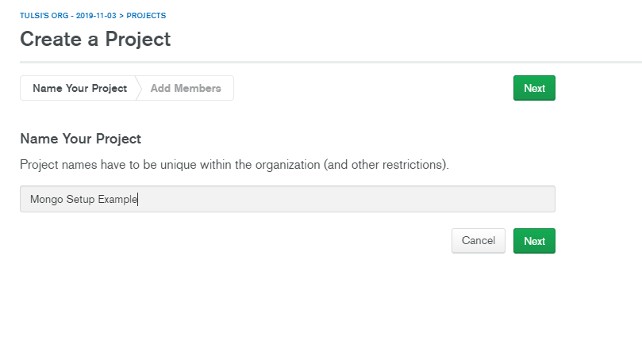

If no one else needs access to this database except for you, you can just hit **create project** in this step.

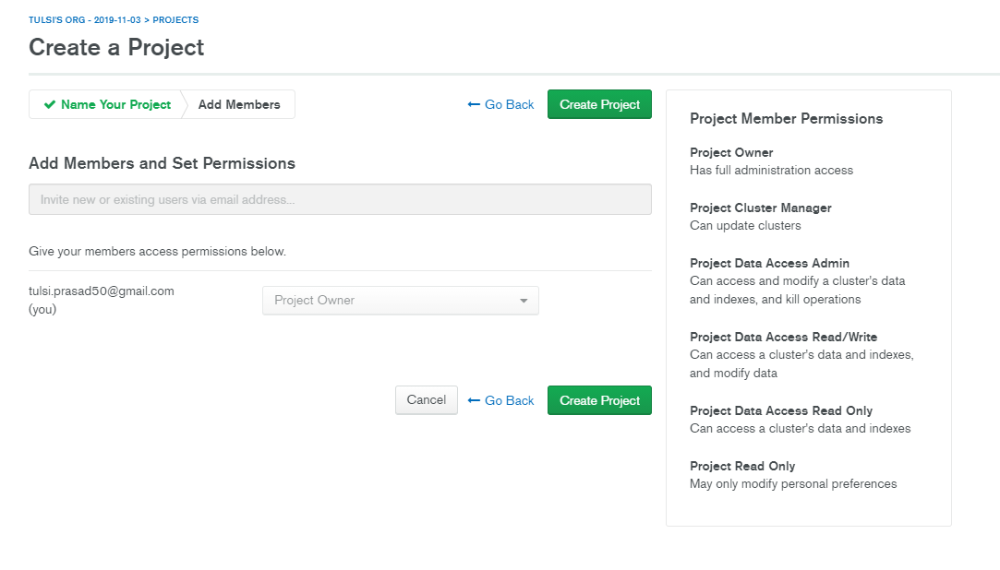

As soon as you have this page, click on **Build a Cluster**.

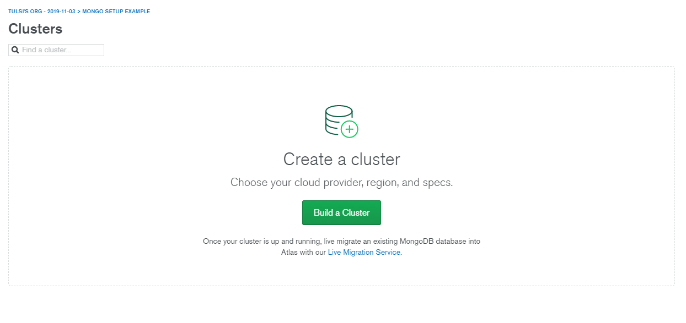

You can choose **Javascript** here, as that's our language of concern and continue.

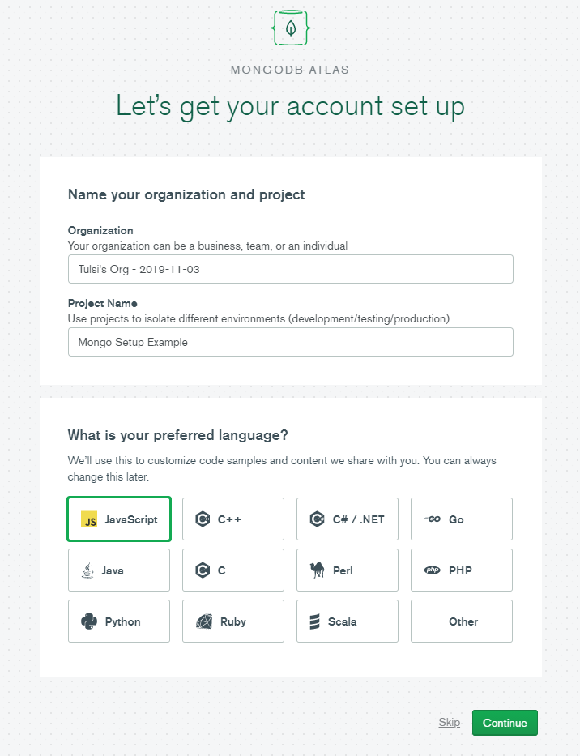

Here comes the pricing part, depending upon your usage you can chose whatever you need, I'm gonna get started with the **free one.**

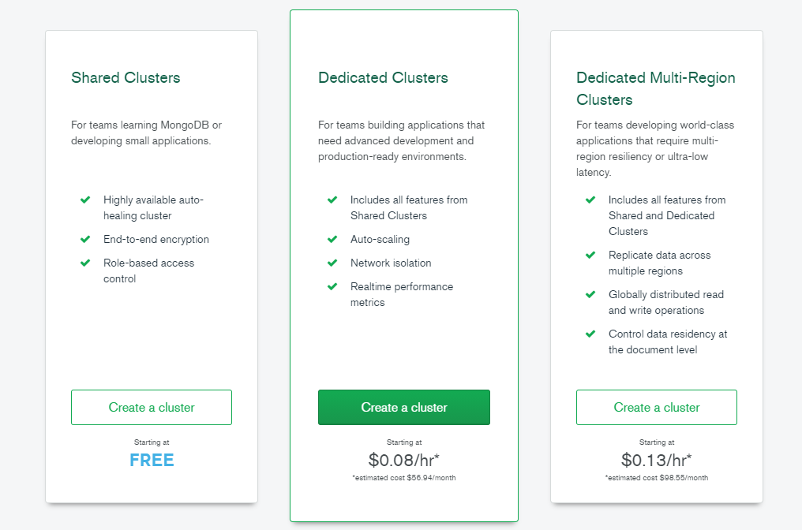

Then you can choose all the default settings and click on **Create Cluster**.

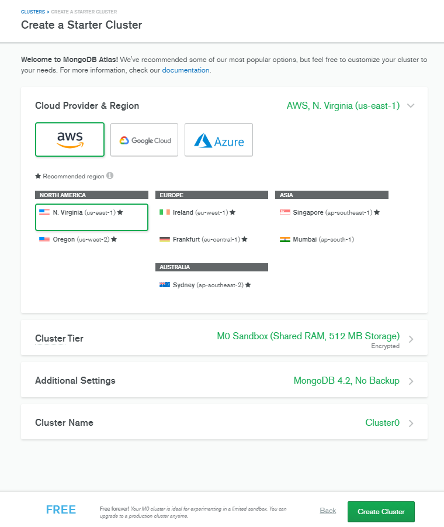

You'll see your cluster is getting created, and it'll take just a couple of minutes to be ready.

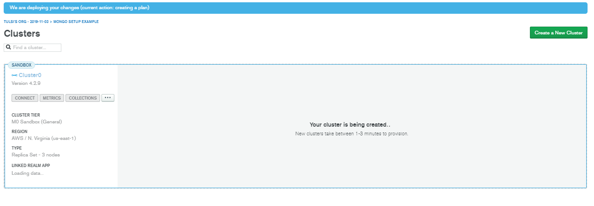

Once it's created, you'll see it like this.

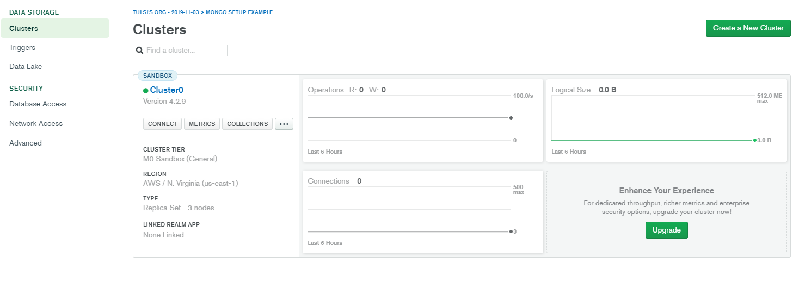

Now we need to do two things, before we can get our **connection string** for our app:

- Create a database user
- Allow database for access

For the first step, you can go to the left sidebar and select **Database Access.**

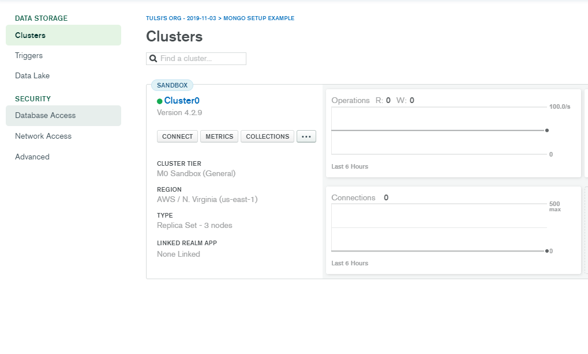

Then you can click on **Add New Database User.**

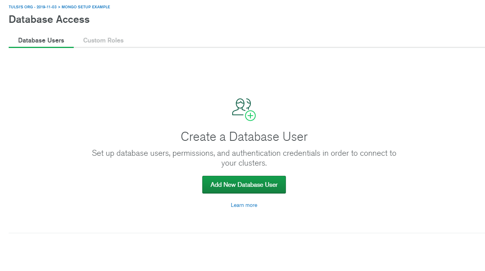

Then you can add a password authentication with required access rights for this user. I have named the user as _admin_ and given it a password, do that step and click **Add user.**

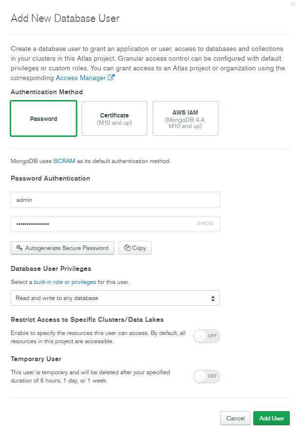

Once it's done the user will appear on the **database access** list, like this.

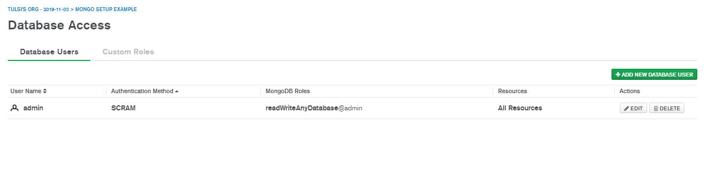

Now, for the second step we shall allow networks to access our database, by **whitelisting our IP address**. For this come to the **Network Access** tab on sidebar and click on **Add IP address**, it'll appear like this.

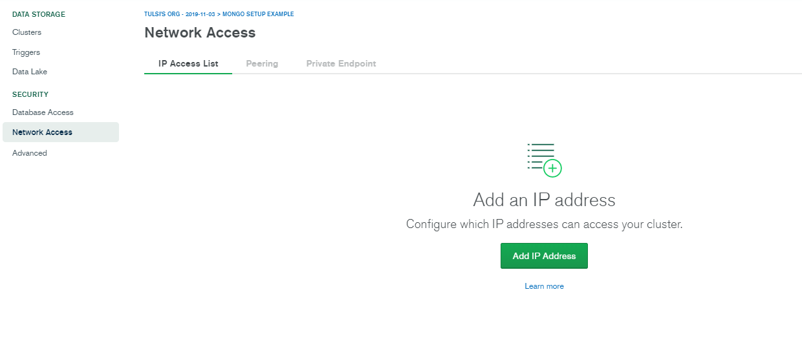

As our app could be used by almost anyone on the internet, we shall select, **allow access from anywhere** and then our access list entry will be filled with `0.0.0.0/0`. Then you can hit Confirm.

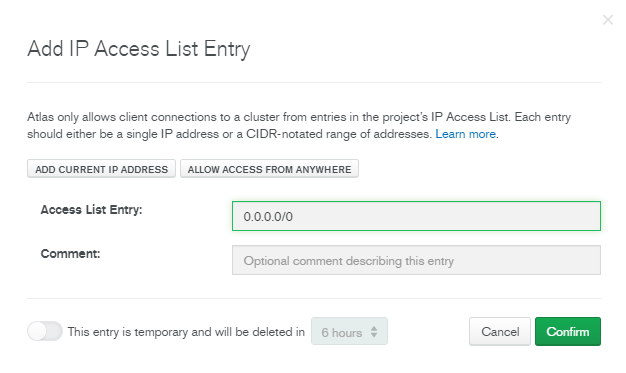

It will take sometime to setup but finally your network access list would look like this.

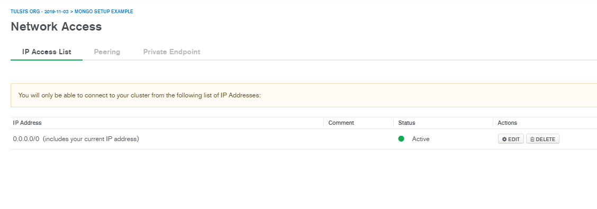

Once this is done, come to the main clusters page and inside the sandbox you should go to **connect**. When you hit connect, you'll get three methods to connect to your database. As now, we need a connection string to connect our application, we'll chose **Connect your Application.**

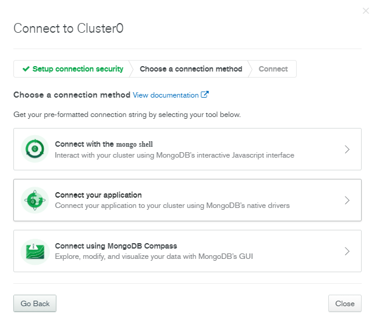

Here you'll get the connection string which we'll copy and paste in our **.env** file.

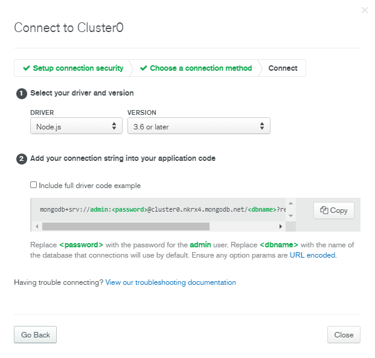

# Paste the string in .env file

```
MONGO_PROD_URI=mongodb+srv://admin:<password>@cluster.mongodb.net/<dbname>?retryWrites=true&w=majority
```

Make sure to replace `<password>` with the password you set above in database access and `<dbname>` with whatever name you want to give your database.

Just so that we're on same page here, this is how my mongoose part looks like this.

```jsx
mongoose
  .connect(process.env.MONGO_PROD_URI, {
    useNewUrlParser: true,
    useUnifiedTopology: true,
    useCreateIndex: true,
  })
  .then(() => console.log("Database connected!"))
  .catch(err => console.log(err));
```

Now hit save and let nodemon reload the server. Did you see, Database connected?

If not and you're getting a bad auth error from Mongo and a huge stack trace like this,

```bash
MongoError: bad auth Authentication failed.
    at MessageStream.messageHandler (C:\Users\alexy\Desktop\learn\mongodb-setup\node_modules\mongodb\lib\cmap\connection.js:268:20)
    at MessageStream.emit (events.js:315:20)
    at processIncomingData (C:\Users\alexy\Desktop\learn\mongodb-setup\node_modules\mongodb\lib\cmap\message_stream.js:144:12)
    at MessageStream._write (C:\Users\alexy\Desktop\learn\mongodb-setup\node_modules\mongodb\lib\cmap\message_stream.js:42:5)
    at doWrite (_stream_writable.js:403:12)
    at writeOrBuffer (_stream_writable.js:387:5)
    at MessageStream.Writable.write (_stream_writable.js:318:11)
    at TLSSocket.ondata (_stream_readable.js:717:22)
    at TLSSocket.emit (events.js:315:20)
    at addChunk (_stream_readable.js:295:12)
    at readableAddChunk (_stream_readable.js:271:9)
    at TLSSocket.Readable.push (_stream_readable.js:212:10)
    at TLSWrap.onStreamRead (internal/stream_base_commons.js:186:23) {
  ok: 0,
  code: 8000,
  codeName: 'AtlasError'
}
```

Then don't worry, I got this too which was because I messed up a wrong password on my `.env` string, so make sure you give database user password correctly and in case you forgot just change the password and add it here. Also, **you should use the user password, not your account password.**

Once we see this, that means our database is connected and you can start adding data.

```bash
Server is running on port 4444
Database connected!
```

# Test adding data to Mongo

To add data using mongoose we have to setup a schema first, you can go through their [Quick Start](https://mongoosejs.com/docs/index.html) to know more about Schemas. Let's add this to our `index.js`.

```jsx
const UserSchema = new mongoose.Schema({
  name: String,
  age: Number,
  isAdult: Boolean,
  joined: {
    type: Date,
    default: Date.now,
  },
});

const User = mongoose.model("users", UserSchema);
```

Now add some data, below it.

```jsx
const newUser = new User({
  name: "Elliot Alderson",
  age: 23,
  isAdult: true,
});

newUser.save().then(() => console.log("Saved new user"));
```

Now when we hit save, this object gets stored in our database and you'll see `Saved new user` in our console. You can see the data on Atlas by clicking on **Collections.**


Here you'll see our `newUser` object stored in the database.

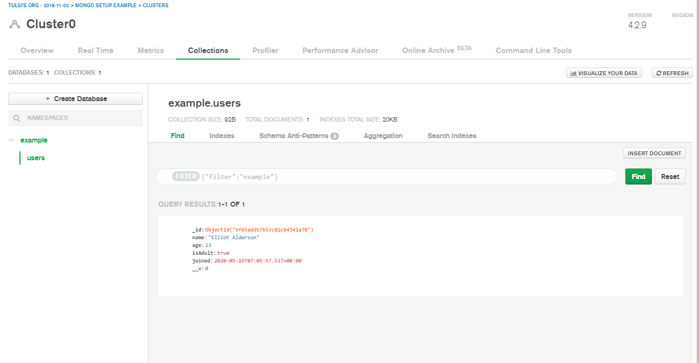

# Using in Development

## Make sure you've MongoDB installed locally

If you haven't then refer to this written guide on installing Mongo on [Mac](https://zellwk.com/blog/install-mongodb/) and [Windows](https://treehouse.github.io/installation-guides/windows/mongo-windows.html). If you prefer video tutorial then, refer to guide on [Mac](https://www.youtube.com/watch?v=DX15WbKidXY&ab_channel=ProgrammingKnowledge) or [Windows](https://www.youtube.com/watch?v=wcx3f0eUiAw&ab_channel=WebDevSimplified).

After installation you can run `mongo -version` from your shell to confirm the installation, also you can access all your local mongo databases through the shell by running the `mongo` command. To know more about using Mongo from shell, [refer this](https://docs.mongodb.com/manual/mongo/).

## Setting .env for local environment

```
MONGO_DEV_URI=mongodb://127.0.0.1:27017/<dbname>
```

Replace `<dbname>` here with name of your database.

Now, the only thing we need to change to run in development is our environment variable. So in our mongoose setup we need to write, `process.env.MONGO_DEV_URI` instead of `process.env.MONGO_PROD_URI`. Let's run `nodemon index.js` to test our code.

**Note:** While using database locally, you can run this code but you'll need to use the [mongo shell](https://docs.mongodb.com/manual/mongo/) or a GUI tool like [Robo 3T](https://robomongo.org/) or [Mongo Compass](https://www.mongodb.com/products/compass).

I personally like **Robo 3T**, as it's fast and performant. This is how data on my local mongodb would look. You can download it from [here](https://robomongo.org/).

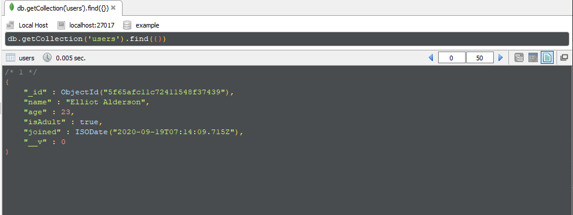

# In the end

Hopefully you learnt something new today or saved time while adding MongoDB to your server without having to fiddle around previous projects and stuff. I'd love to know your views, on my [Dev.to](http://dev.to) comments or see you around on [Twitter](https://twitter.com/heytulsiprasad).
