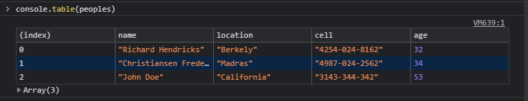
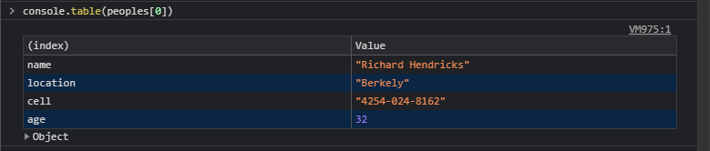
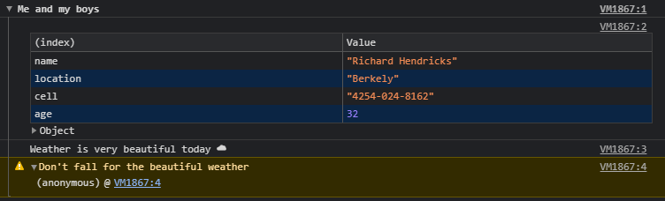
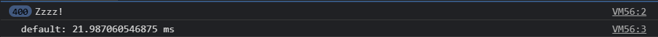
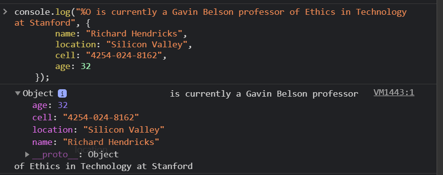
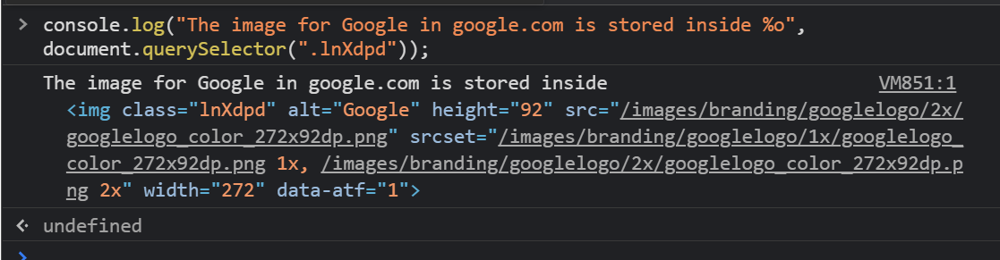
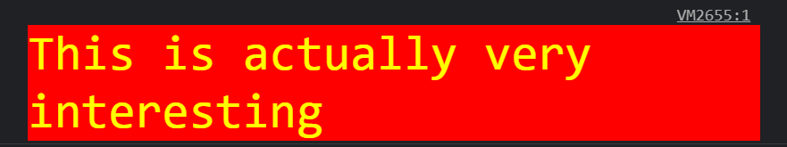
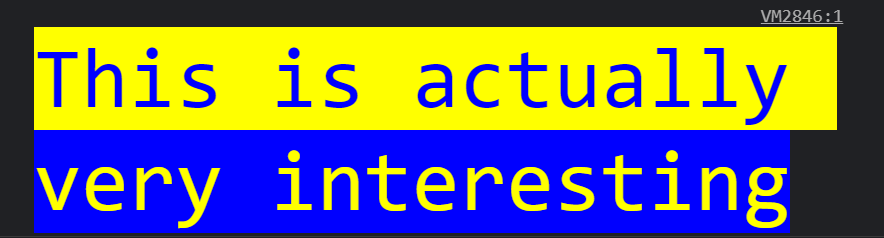
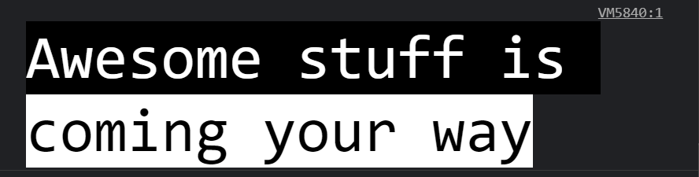

Yes, the above image is from the console and you can customize the text however you like. To know how keep reading till the end.

It's been a while since my last post, it's because I got into learning some interesting stuff and undoubtedly writer's block was back. But recently, while working on a large repository that had a lot of stuff logged in the console I wanted a way to clear all the clutter and make my console statements stand out from the rest.

Here is how I was able to do that and how you could too.

So these are the possible options:

- Using different console methods
- Using various format specifiers (believe me, this is magic ✨)

# Using different console methods

You might already know some of the basic ones, like:

- `console.log`
- `console.info`
- `console.error`
- `console.warn`

But some of the more cool ones, are:

## `console.table`

This can be used to log large nested objects or arrays so you don't have to go through expanding each key to view the whole thing.

```jsx
let peoples = [
  {
    name: "Richard Hendricks",
    location: "Berkely",
    cell: "4254-024-8162",
    age: 32,
  },
  {
    name: "Christiansen Frederikke",
    location: "Madras",
    cell: "4987-024-2562",
    age: 34,
  },
  {
    name: "John Doe",
    location: "California",
    cell: "3143-344-342",
    age: 53,
  },
];

console.table(peoples);
```



You can also log objects as such:



## `console.group` and `console.groupEnd`

You can group a set of console logs having a particular meaning apart from the rest using this method.

```jsx
const title = "Me and my boys";

console.group(title);
console.table(peoples[0]);
console.info("Weather is very beautiful today ☁");
console.warn("Don't fall for the beautiful weather");
console.groupEnd(title);
```

This is what it'll return:



**Pro Tip:** Use `console.groupCollapsed()` to have the logs closed by default.

## `console.time()` and `console.timeEnd()`

If at all you're ever interested to know how much time a particular block of code takes to run, you can achieve this using `console.time()`.

```jsx
console.time();
Array.from(new Array(400)).forEach(_ => console.log("Zzzz!"));
console.timeEnd();
```



## `console.count(label)`

It logs incrementing counter values starting from 0. You can use `label` to distinguish between different counters. To stop one from counting above, you've to use `console.countReset(label)`.

```jsx
console.count("Awesome"); // Awesome: 1
console.count("Awesome"); // Awesome: 2
console.count("Awesome"); // Awesome: 3
console.count("Awesome"); // Awesome: 4
console.countReset("Awesome");

console.count("Awesome"); // Awesome: 1
```

# Using format specifiers

Believe it or not, console logs can be more than just simple messages. You can include an eye-catching message or something more convincing as your favorite dog image.

All because you can use format specifiers inside them. How?

### List of available format specifiers

- %s ⇒ Formats as string
- %i ⇒ Formats as integer
- %f ⇒ Formats as float
- %O ⇒ Formats as object (yes that's capital O as in Oregano)
- %o ⇒ Formats as DOM element
- %c ⇒ Formats as CSS ✨

### Formats as string, integer, float

```jsx
console.log(
  "%s, told me that we're going to mall today with %s",
  "Alan",
  "Mike"
);
// Alan, told me that we're going to mall today with Mike

console.log("We had %i mangoes today", 56);
// We had 56 mangoes today

console.log(
  "Did you know, Tesla Model S can reach 0 to 60 mph in %f seconds?",
  2.3
);
// Did you know, Tesla Model S can reach 0 to 60 mph in 2.3 seconds?
```

### Formats as Object



### Formats as DOM Element



### Formats as CSS

Adding your CSS to the second argument of console log by separating each of them with `;` does the trick.

```jsx
console.log(
  "%cThis is actually very interesting",
  "color: yellow; font-size: 35px; background-color: red;"
);
```



You can also add multiple styles in the same log by using multiple %c specifiers.

```jsx
console.log(
  "%cThis is actually %cvery interesting",
  "color: blue; font-size: 55px; background-color: yellow;",
  "font-size: 55px; background-color: blue; color: yellow"
);
```



If that looks a bit messy and you have a lot of styles to give you can put the styles in a separate array and use them wisely.

```jsx
let blackBackground = [
  "font-size: 50px",
  "background-color: black",
  "color: white",
].join(" ;");

let whiteBackground = [
  "font-size: 50px",
  "background-color: white",
  "color: black",
].join(" ;");

console.log(
  "%cAwesome stuff is %ccoming your way",
  blackBackground,
  whiteBackground
);
```



Last but not the least, a picture says a thousand words.

```jsx
let backgroundImage = [
  "background-image: url(https://source.unsplash.com/random/1200x800)",
  "background-size: cover",
  "color: hotpink",
  "padding: 100px",
  "font-weight: bold",
  "font-size: 25px",
].join(" ;");

console.log("%cPicture says a thousand words", backgroundImage);
```


You can do all sorts of manipulation and get more creative with the power of CSS, it's up to you.

If you're still wondering how the above banner was made, well here's that code.

```jsx
let backgroundImage = [
  "background-image: url(https://i.pinimg.com/originals/5b/43/02/5b4302c2f6413454c782aeec866143cf.gif)",
  "background-size: cover",
  "color: black",
  "padding: 100px",
  "font-weight: bolder",
  "font-size: 40px",
  "-webkit-text-stroke-width: 1px",
  "-webkit-text-stroke-color: yellow",
  "text-transform: uppercase",
  "text-align: center",
  "letter-spacing: 1px",
].join(" ;");

console.log("%cMay the force be with you", backgroundImage);
```


That's it, super easy! 😃

## Conclusion

For me, all that mattered was for the logs to stand out and be more catchy on pursuit of which I found out a ton of more cool stuff we can do, hope this gives you more clarity on the gem of a function, that console is.
