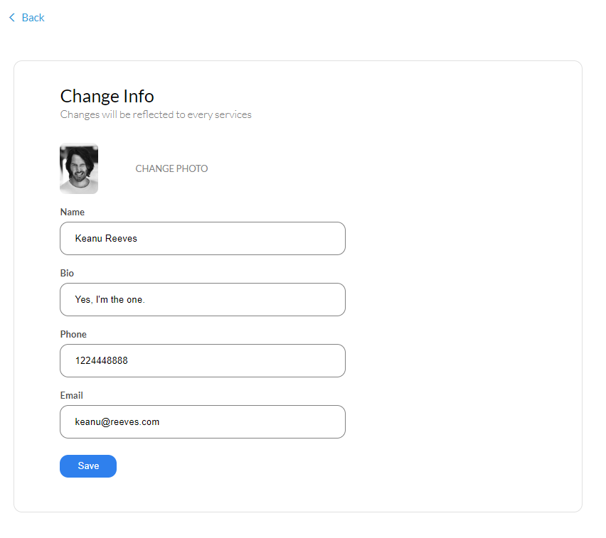
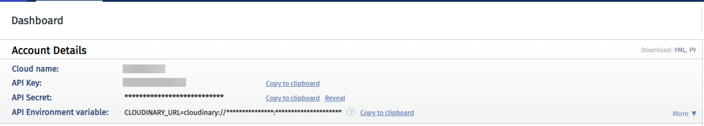
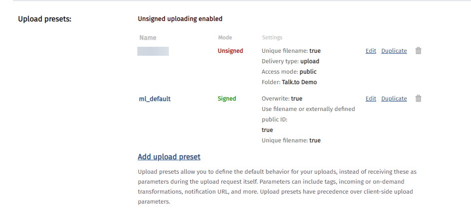

Hey everyone! In today's standards, it's not uncommon to see every other website has some kind of visual content by themselves or for the user to upload. And keeping factors such as performance, rich image optimization it becomes even difficult to handle all of it using built in techniques. That's the problem [Cloudinary](https://cloudinary.com/) solves almost perfectly, thus we'll see how to implement it in our React app ecosystem.

# Living Example

I usually don't like making examples just for blogs (as they're time consuming) but I like showing real projects that I worked on and how I implemented it in my project.

Speaking of, last week I made [this app](https://talk-to.vercel.app/) to learn about authentication, where you can create your account (OAuth/Local) and edit your info, like image and name, so I liked to try out Cloudinary. You can tap _Change Photo_ (on edit page) to add your photos, this is handled by Cloudinary in React itself. You can find it on my GitHub. ([talkto-frontend](https://github.com/heytulsiprasad/talkto-frontend) and [talkto-backend](https://github.com/heytulsiprasad/talkto-backend))




# Do you have a Cloudinary Account?

You can create a free account on Cloudinary, [here](https://cloudinary.com/users/register/free). I'll show how to setup your project on there with screenshots below.

# Creating the Markup

So to upload any file from the frontend, we need to have an `input` tag with type equals to `file`. Then we'll pass the file inside a `FormData` object and make the post request to our Cloudinary endpoint (we'll see how to get one below).

Here, `InputFieldImage` is a child (presentational) component which contains our `input` tags and all the values are passed to it from its stateful parent component. [Link to source.](https://github.com/heytulsiprasad/talkto-frontend/blob/master/src/components/Profile/InputFieldImage.jsx#L62-L67)

```jsx
const InputFieldImage = ({ title, id, value, ...rest }) => (
  <FieldContainer>
    <ImageFieldContainer>
      
      <span className="material-icons input-icon">camera_alt</span>
      <input id={id} {...rest} />
      <label htmlFor={id}>{title}</label>
    </ImageFieldContainer>
  </FieldContainer>
);
```

This is the how `InputFieldImage` is called from its stateful parent component. [Link to source.](https://github.com/heytulsiprasad/talkto-frontend/blob/master/src/components/Profile/EditInfo.jsx#L138-L145)

```jsx
<InputFieldImage
  title="Change Photo"
  value={image}
  id="upload-photo"
  type="file"
  accept="image/png, image/jpeg"
  onChange={this.imageChangeHandler}
/>
```

Now all we need to care about is that onChange handler, `imageChangeHandler`, which goes like this. You can display beautiful toasts using the `imageError` dialogs we've provided, to increase user experience. [Link to source.](https://github.com/heytulsiprasad/talkto-frontend/blob/master/src/components/Profile/EditInfo.jsx#L90-L113)

```jsx
imageChangeHandler = e => {
  const imageFile = e.target.files[0];

  if (!imageFile) {
    this.setState({ imageError: "Please select image. " });
    return false;
  }

  if (!imageFile.name.match(/\.(jpg|jpeg|png|gif)$/)) {
    this.setState({ imageError: "Please select a valid image." });
    return false;
  }

  // Utils function
  imageUpload(imageFile, url => {
    this.setState(state => ({
      ...state,
      profile: {
        ...state.profile,
        image: url,
      },
    }));
  });
};
```

Here, `imageUpload` is an utils function that handles the post request work to Cloudinary and then runs our `this.setState` inside its callback which then passes the fetched image url as a prop to `InputFieldImage` component. This is how our image is displayed on the box after its uploaded.

# Getting the Cloudinary Endpoint

Once you logged in, this is how you're dashboard will look like.



And your endpoint will be something in terms of this: [`https://api.cloudinary.com/v1_1/:cloud_name/:action`](https://api.cloudinary.com/v1_1/:cloud_name/:action)

Our action here would be `/image/upload` as we're uploading images and cloud name will be as shown in your dashboard.

One last thing we need is an upload preset, which we'll pass with our `FormData` object, it'll define default behavior of your uploads. You can create/get one inside **Settings →** **Upload** then scroll down to upload presets.



If you're creating one, you can select signing mode as **Unsigned**. This will allow you to perform uploads directly from the browser without going through your servers. Once it's done, hit save and you're preset name will appear as shown above.

# Making the upload request

As discussed, we need to create our `imageUpload` utils function now. [Link to Source](https://github.com/heytulsiprasad/talkto-frontend/blob/master/src/utils/imageUpload.js).

```jsx
import axios from "axios";

const imageUpload = (imageFile, callback) => {
  const formData = new FormData();

  formData.append("file", imageFile);
  formData.append(
    "upload_preset",
    process.env.REACT_APP_CLOUDINARY_UPLOAD_PRESET
  );

  axios
    .post(
      `https://api.cloudinary.com/v1_1/${process.env.REACT_APP_CLOUDINARY_CLOUD_NAME}/image/upload`,
      formData
    )
    .then(res => res.data.secure_url)
    .then(url => callback(url))
    .catch(err => new Error(err));
};

export default imageUpload;
```

This function takes, `imageFile` from our component and the `upload_preset` we get above, then appends it to the FormData object which is then passed along with the post request to our endpoint. We also pass a `callback` function that is called after the image link is obtained, where the state is changed and new image link is passed on as prop to `InputFieldImage`.

# Cloudinary Upload Widget

This is a great feature that you can take advantage of. It shows an upload widget which allows you to upload files from various sources, like Dropbox or Google Drive. You can also add it to your project according to requirements. You can refer [the official docs](https://cloudinary.com/documentation/upload_widget) or [this blog](https://medium.com/@jordanmmartin/quickstart-guide-to-using-cloudinary-upload-widget-v2-in-react-4c4d9041d55e) for clarification with React.


Although I haven't used any transformations in my example, but you can absolutely use them if you want to crop or do some fancy edits, all you have to do is add your transformation to end of your request endpoint. Or if you want the edits to happen by default you can do so while setting your upload preset.

This is what an endpoint will look like if you want to crop an image. [Refer docs for more.](https://cloudinary.com/documentation/image_transformations)

[`https://res.cloudinary.com/demo/image/upload/w_200,h_150,c_crop/sample.jpg`](https://res.cloudinary.com/demo/image/upload/w_200,h_150,c_crop,g_north_west/sample.jpg)

# Conclusion

Cloudinary provides many more powerful features like video compressing for fast loading and robust transformations. It also has a wide range of integrations for use with any platform of your choice. You can have all information on their [homepage](https://cloudinary.com/). It's free account gives 25 credits which allows for approx 1GB of storage ([check pricing](https://cloudinary.com/pricing)). You can see all your uploads inside **Media Library.**

Have a great day :)
