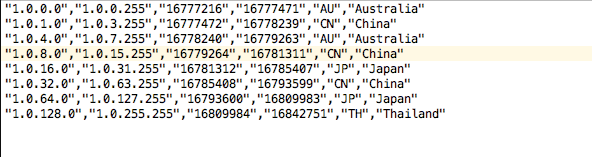

# What is Reduce and why does it exists?

Hey everyone! It's been a while since my last post, so sorry for that. I went down that rabbit hole of exploring new frameworks again. It was Gatsby and I enjoyed it. It is quite performant with less effort and has a lot of plugins for most purposes which leaves you to do the most important task itself, building your site. You should check [Gatsby](https://www.gatsbyjs.com/) out.

# What is Reduce?

Reduce is simply an array method in JavaScript, that takes a callback function which iterates over the given array. Trust me, this is as simple to understand as this.

But the important thing is, how it iterates over the array and why it is considered so helpful. That we are going to see below, but with an example.

# How to write an `Array.reduce`?

Let's go with a basic example first, so after you understand we can explore a rather complex one. For instance, we have an array of numbers, called amounts.

```jsx
let amounts = [100, 200, 400, 300];
```

Now, what will you usually do if you're told to add these above numbers? We can do stuff like `for` or `forEach` , as such below snippet.

```jsx
let totalAmount = 0;

for (let i = 0; i < amounts.length; i++) {
  totalAmount += amounts[i];
}

console.log(totalAmount); // 1000
```

Well even if it's possible using for loops, using `reduce` is rather more compact and readable. Let's see how.

```jsx
let totalAmount = amounts.reduce((sum, item) => sum + item, 0);

console.log(totalAmount); // 1000
```

See, we get the same result with just one line of code and much more readability. So that's how you write a reduce method.

# Let's do something more cooler.

Alright, now we know what a reduce method does and is capable of. Let's write something cooler.

What if, you're given a CSV (comma separated value) file containing name, place, age and work data of people and told to parse the data in a consumable (or readable) format or maybe a JSON file. How will you handle that?

But wait, if you never seen a CSV file, don't be scared, it just what the name tells itself.



They are just some data separated by a comma (,) which is a standard of files in data handling.

For this example, I've used a CSV file containing `id`, `first_name`, `last_name`, `email` and `gender` of 100 people. You can copy the file from this GitHub gist, [sample.txt](https://gist.github.com/heytulsiprasad/d618cd367eb28b1154ba068dcda731f4).

Also I use [repl.it](http://repl.it) for playing around with such concepts, it's just easy to setup (like in one click) rather than setting up a whole server locally, or even the clumsy browser snippets tab. All you need to do is, go to [repl.it](http://repl.it) and create your account (if you want to store your code) else just select a language and start coding.

So, let's create a csv file first and name it `sample.csv`. Now copy the csv file contents from this [gist](https://gist.github.com/heytulsiprasad/d618cd367eb28b1154ba068dcda731f4) and paste it in your csv file.

```
1,Donnamarie,Jemison,djemison0@ifeng.com,Female
2,Herculie,Chadbourne,hchadbourne1@opensource.org,Male
...
```

This is how you're csv file will look, except for a hundred lines. Now in our JavaScript file, we'll import this data as shown below.

```jsx
const fs = require("fs");

const rawData = fs.readFileSync("sample.csv", "utf-8");
```

Now, if you console log the `rawData` you'll see something like such, which are mere string values.

```
1,Donnamarie,Jemison,djemison0@ifeng.com,Female
2,Herculie,Chadbourne,hchadbourne1@opensource.org,Male
3,Shepperd,Luquet,sluquet2@so-net.ne.jp,Male
4,Sinclare,Nuttey,snuttey3@tmall.com,Male
...
```

So, to get them into an object and to apply reduce on them, we need to make an array of it first. Let's do it.

```jsx
const listedData = rawData.trim().split("\n");
```

Now, the `listedData` is an array which holds an entire persons data on a single string, separated by commas. Half our job is done here and we can reduce it now, to get an array of objects.

```jsx
let parseData = listedData
  .map(item => item.split(","))
  .reduce((acc, item) => {
    acc.push({
      id: item[0],
      first_name: item[1],
      last_name: item[2],
      email: item[3],
      gender: item[4],
    });
    return acc;
  }, []);
```

Okay, that's a heavily spaced out piece of code, bear me this will be much easier to understand.

So firstly, we take the `listedData` array which was just an array of strings of data about people. As shown below.

```bash
[
  '1,Donnamarie,Jemison,djemison0@ifeng.com,Female',
  '2,Herculie,Chadbourne,hchadbourne1@opensource.org,Male',
  '3,Shepperd,Luquet,sluquet2@so-net.ne.jp,Male',
  '4,Sinclare,Nuttey,snuttey3@tmall.com,Male'
	...
]
```

Now we need to map over each string and split it from the comma (",") to make an array of its own. This will be as shown below.

```bash
[
  [ '1', 'Donnamarie', 'Jemison', 'djemison0@ifeng.com', 'Female' ],
  [ '2', 'Herculie', 'Chadbourne', 'hchadbourne1@opensource.org', 'Male'],
  [ '3', 'Shepperd', 'Luquet', 'sluquet2@so-net.ne.jp', 'Male' ],
  [ '4', 'Sinclare', 'Nuttey', 'snuttey3@tmall.com', 'Male' ],
	...
]
```

**Pro Tip:** You can console.log the output anywhere you don't understand or need more clarity and I'm sure everything will make more sense after that.

Finally we reduce each sub array in the big array and make it to an object containing id, first name, last name and gender. As you can see, reduce takes in a callback function as in first example with two arguments: `acc` and `item`, and an empty array in the end, which is assigned to `acc` as initial value.

Now as we loop over the big array, on each iteration `item` represents one of the small arrays and the `acc` creates an object from strings within each small array and pushes it to its inital value, [ ].

And this is how we, create an array of objects for each person from a CSV file, as shown below.

```bash
[
  {
    id: '1',
    first_name: 'Donnamarie',
    last_name: 'Jemison',
    email: 'djemison0@ifeng.com',
    gender: 'Female'
  },
  {
    id: '2',
    first_name: 'Herculie',
    last_name: 'Chadbourne',
    email: 'hchadbourne1@opensource.org',
    gender: 'Male'
  },
  {
    id: '3',
    first_name: 'Shepperd',
    last_name: 'Luquet',
    email: 'sluquet2@so-net.ne.jp',
    gender: 'Male'
  },
  {
    id: '4',
    first_name: 'Sinclare',
    last_name: 'Nuttey',
    email: 'snuttey3@tmall.com',
    gender: 'Male'
  },
	...
]
```

## **Exporting to a JSON file**

Just for fun, you can export the output we got into a json file too like such.

**To convert into JSON**

We can now convert this to a JSON structure instead of an object by using `JSON.stringify`, like such.

```jsx
const jsonData = JSON.stringify(parseData, null, 8);
```

**Writing to JSON file**

We can use `writeFileSync` from filesystem module to write to a JSON file like this:

```jsx
fs.writeFileSync("sample.json", jsonData);
```

As you'll now see a new file gets created with all the data you had in the csv file in a JSON format.

# Conclusion

It's easy to do a lot of things in reduce which is like a superpower. Personally, when I used reduce I felt I don't need to have a variable name for everything and that makes stuff easier for me to debug and working with nice looking, more understandable code makes my day better. You can discuss more with me on Twitter, [@heytulsiprasad](https://twitter.com/heytulsiprasad).

# Further Reading

You can check these out for more examples on using reduce!

- [A Guide To The Reduce Method In Javascript​](https://www.freecodecamp.org/news/reduce-f47a7da511a9/)
- [Useful "reduce" use cases](https://itnext.io/useful-reduce-use-cases-91a86ee10bcd)
- [Array.prototype.reduce()](https://developer.mozilla.org/en-US/docs/Web/JavaScript/Reference/Global_Objects/Array/reduce)
- [Explanation of javascript's reduce() with a real world use case](https://medium.com/@trekinbami/explanation-of-javascripts-reduce-with-a-real-world-use-case-f3f5014951e2)
