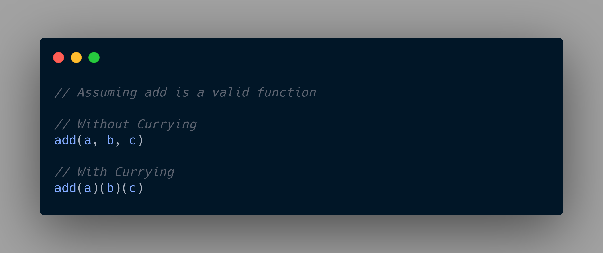

Hey everyone, nice to see you on my little home on internet! I'm going through some concepts which I had skipped while beginning to learn JavaScript and here we are. So, now we'll see what's the matter with one of the fancy terms in JavaScript, Currying.

# Literally,

Despite being a fancy term, (according to [Wikipedia](https://en.wikipedia.org/wiki/Currying)) **currying** is a technique of converting a function that takes multiple arguments into a sequence of functions that each take a single argument. Now whether you're a JavaScript fanboy or did basic algebra in high school that'll totally make sense to you.

But if not, all it says is if we have a function that takes in more than one arguments and we are converting it into another function that takes those number of arguments but one at a time or sequentially. The below picture makes it clear.

Anyways, how does that happen in real world, (or programatically) let's find out!



# How to write a curry function?

We know how to write a normal function (without currying), for example `add()` above, which is simple as such.

```jsx
function add(a, b, c) {
  return a + b + c;
}

console.log(add(1, 2, 3)); // 6
```

But this is how we write the same function in a curriable manner.

```jsx
function add(a) {
  return function (b) {
    return function (c) {
      return a + b + c;
    };
  };
}

console.log(add(1)(2)(3)); // 6
```

If you notice in the curry function, for every passed argument inside `add()` we are returning one new function which takes another argument and returns another function. And at last, after passing the last argument we return the final result. This is the basic struture of a curry function.

So for `add(1)` in the curry function, we don't get a value as a result rather a whole new function which takes `(2)` as an argument and it goes on until we get a value in output.

# Using with helper functions

As currying function is not easier to write (always), but being a major concept in functional programming we have many helper functions that help us transform a normal function into a curry function.

These can be done by most JavaScript utility libraries like **[Lodash](https://lodash.com/docs/4.17.15#curry)**, **[Rambda](https://ramdajs.com/docs/#curry)** and [so on](https://blog.bitsrc.io/11-javascript-utility-libraries-you-should-know-in-2018-3646fb31ade), with one simple step like this. Also, I'm using lodash in this example.

```jsx
const _ = require("lodash");

function add(a, b, c) {
  return a + b + c;
}

const curryAdd = _.curry(add);

console.log(add(1, 2, 3)); // 6
console.log(curryAdd(1)(2)(3)); // 6
```

# Creating new functions from existing ones

This is how curry functions are mostly used in real life as it helps us create entire new functions and export them to use it anywhere .

For instance, we are having this array of objects.

```jsx
const items = [
  { name: "Mango", type: "Fruit" },
  { name: "Tomato", type: "Vegetable" },
  { name: "Strawberry", type: "Fruit" },
  { name: "Potato", type: "Vegetable" },
  { name: "Turnip", type: "Vegetable" },
  { name: "Banana", type: "Fruit" },
  { name: "Carrot", type: "Vegetable" },
];
```

Now we need to create a function, that returns all items of type `Fruits` or `Vegetables`. So, let's do this using the curry concept that we just learned.

```jsx
const isType = obj => type => obj.type === type;

const isFruit = item => isType(item)("Fruit");
const isVegetable = item => isType(item)("Vegetable");

const fruits = items.filter(isFruit);
const vegetables = items.filter(isVegetable);
```

Woah, this looks so clean. But how does this work?

Firstly we are having the `isType()` as a curry function, which takes in an object and returns a boolean (true/false) after checking it's type is equal to the passed argument type or not.

But instead of using this function directly, we are creating two more functions that checks for whether type is fruit or vegetable separately. By seeing it's structure, you'll notice it just takes one argument which is the current item and calls `isType()` by passing `item` and the desired type.

Finally, to get our fruits and vegetables we run a `.filter()` array method passing either `isFruit` or `isVegetable` as a callback function. This by default passes our current item inside `items` array to the callback. To be more clear, what we've done in the end is same as, below.

```jsx
const fruits = items.filter(item => isFruit(item));
const vegetables = items.filter(item => isVegetable(item));
```

### **Results**

`console.log(fruits)`

```bash
[
  { name: 'Mango', type: 'Fruit' },
  { name: 'Strawberry', type: 'Fruit' },
  { name: 'Banana', type: 'Fruit' }
]
```

`console.log(vegetables)`

```bash
[
  { name: 'Tomato', type: 'Vegetable' },
  { name: 'Potato', type: 'Vegetable' },
  { name: 'Turnip', type: 'Vegetable' },
  { name: 'Carrot', type: 'Vegetable' }
]
```

Ultimately, we came to know how to write a curry function, which was way easier than we thought.

## Edit

Can you think of a slightly different way to write our functions in the above example, to write less code and make it more straightforward? Is it possible?

Yes and thanks to [Rudy Nappée](https://dev.to/devdufutur) for showing us the same in the [comments](https://dev.to/devdufutur/comment/1465n) and I thought it'll be useful for everyone reading this post.

So, what we should do is: "**Always put the point (argument on which the partial application operates in the end) at the last position**".

```jsx
const isType = type => obj => obj.type === type;
```

In this way, we don't have to redefine yet another function, like we did for `isFruit` and `isVegetable` , instead we can write.

```jsx
const isFruit = isType("Fruit");
const isVegetable = isType("Vegetable");
```

Or you can write it in a more straightforward way, directly in the filter callbacks.

```jsx
const fruits = items.filter(isType("Fruit"));
const vegetables = items.filter(isType("Vegetable"));
```

# Making our own helper function

After being able to transform a normal function to a curry function using a helper function, like `.curry()` from [Lodash](https://lodash.com/), I was curious to know how to build one for ourselves. Because, you know at times, we only need handful of functions for which including a giant utility library like [Lodash](https://github.com/lodash/lodash) isn't necessary.

Let's create a simple usecase first, then we'll go off to create the actual curry function.

```jsx
// Assume that curry is a valid function

const multiply = (a, b) => a * b;

const curryMultiply = curry(multiply);

console.log(multiply(2, 4)); // 8
console.log(multiply(2)(4)); // 8
```

Don't hit run now, as we yet have to fulfill our assumption and create a valid curry function. And upon running this will definitely give a `Reference Error` as `curry` is not defined.

Building the actual `curry()` function.

```jsx
function curry(func) {
  return function curried(...args) {
    if (args.length >= func.length) {
      return func.apply(undefined, args);
    } else {
      return function (...rest) {
        return curried.apply(undefined, rest.concat(args));
      };
    }
  };
}
```

Firstly, we are creating a function named curry and return another function from it, which is named as curried. As you can see, in the returned function we are checking the number of arguments passed to it, if the number exceeds or is equal to number of arguments the actual function `func` expects (also called **[arity](https://stackoverflow.com/questions/4848149/get-a-functions-arity))** then we return the function by calling apply and passing in all the args.

In case, we got less number of arguments (which happens while we pass parameters one by one) we return another function which stores its arguments in a variable called `rest`. Finally, we call the same function `curried()` recursively and pass it the new arguments in `rest` variable and concat it with previosly gotten arguments in `args` variable.

Also, if you're wondering what those 3 dots are (`...`), they're a new feature in [ES6](https://developer.mozilla.org/en-US/docs/Web/JavaScript/Reference/Functions/rest_parameters) or [ECMAScript2015](https://www.digitalocean.com/community/tutorials/js-rest-parameters-es6). They return us all the passed arguments to a function.

Now, if you press enter or run your code you'll see you get the right output, like this.

```jsx
console.log(multiply(2, 4)); // 8
console.log(multiply(2)(4)); // 8
```

You can save this snippet in your Gist or understand it properly, so anytime you just want to use a function with currying instead of writing the function again, you can create a new function altogether by passing old non-curriable function into this `curry()` method we just created.

# Hurray 🎉

If you're with me yet, then hurray! I hope you learned something new or you could get an edge over fixing hour old bugs. Throw me a tweet at **[@heytulsiprasad](https://twitter.com/heytulsiprasad)** if you find something I missed or just want to say Hi (really that's becoming important these days). You can expect more blogs on functional programming in coming days.

# Further Reading

- [Currying - Part 6 of Functional Programming in JavaScript](https://www.youtube.com/watch?v=iZLP4qOwY8I)

- [Curry and Function Composition](https://medium.com/javascript-scene/curry-and-function-composition-2c208d774983)

- [A Beginner's Guide to Currying in Functional JavaScript - SitePoint](https://www.sitepoint.com/currying-in-functional-javascript/)

- [Understanding Currying in JavaScript](https://blog.bitsrc.io/understanding-currying-in-javascript-ceb2188c339)
